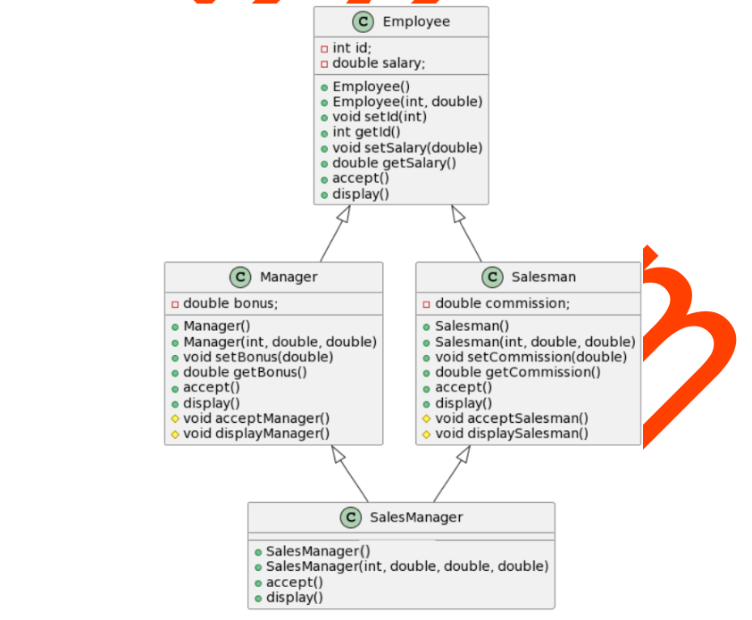

- >>q1
- Q1. Create a class Date with data memebrs day,month and year.
  Cretae a class Person with data members name,address and birthdate. The birthdate shoud be of
  type Date.
  Cretae a class Employee with data members id, sal, dept and joining date. The joining date should
  be of type date.
  Employee class should be inherited from Person.
  Implement following classes. Test all functionalities in main().
  (Note - Perform the Association and Inheritance in the above case.)
- ---
- >>q2
- Q2. A shop sells book or tapes. The Book class holds id, title, author, and price; whereas Tape class
  holds id, title, artist, and price. There is 5% discount on tapes, while 10% discount on books.
  Assuming that each user purchase 3 products (either book or tape), calculate final bill. The program
  should be menu driven and should not cause memory leakage.
  Hint - Create class Product and inherit into Book and Tape. Also create array like Product* arr[3]
- ---
- >>q3
- Q3. Implement following classes. Test all functionalities in main() of each created class. Note that
  employee is inherited into manager and salesman
- 