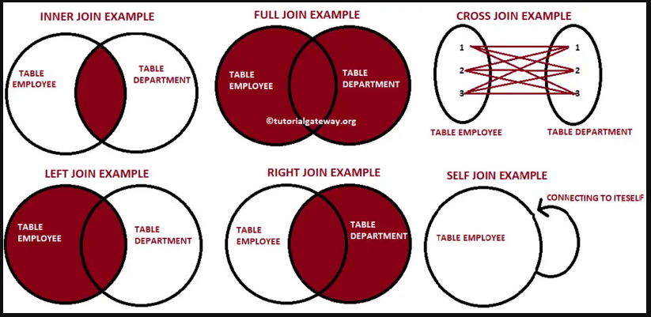

- connecting two tables based on their common fields
- [[Cartesian join]]
- [[cross joins]]
- [[inner joins]]
- [[outer join]]
- [[self join]]
- [[multiple joins]]
-
- #[[Cross join vs full outer join]]
	- cross join will print all possible combinations i.e no nulls
	- full join will print all rows if not matched then null
	- #[[cross joins]] | #[[full outer join]]
-
- 