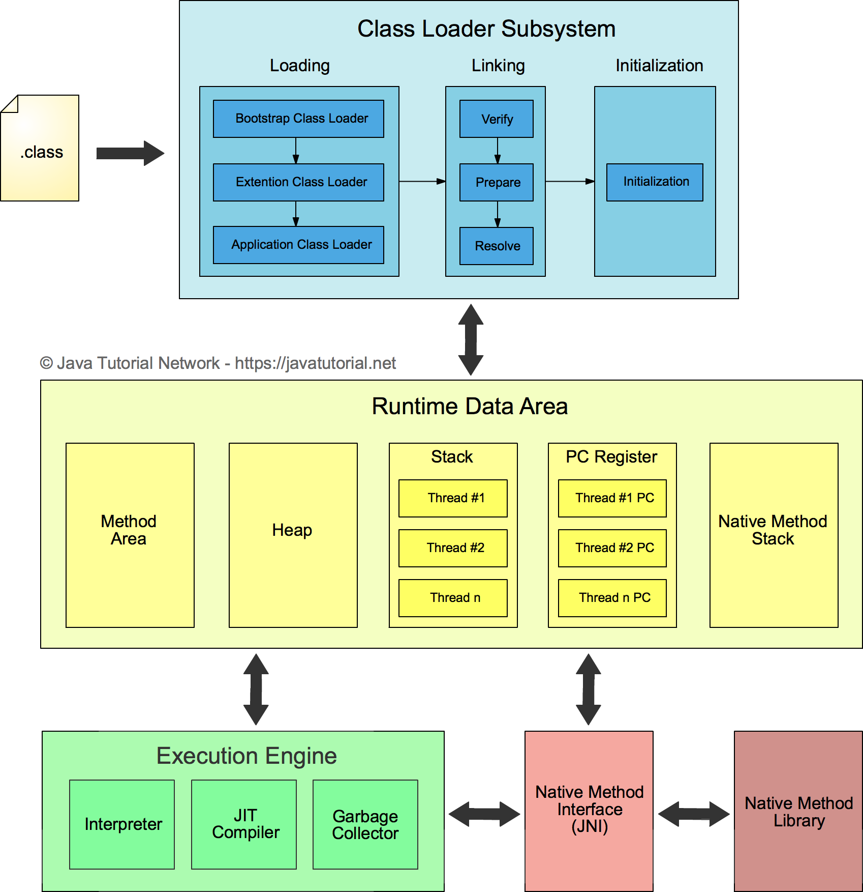

- Java code execution cycle
	- class loader system
		- bootstrap loader
			- load required jar files `rt.jar`
		- extention class loader
			- load external imported library classes
		- application class loader
			- load project classes
	- linker
		- verification
			- is a java compiler used to compile; proper compilation performed?
		- preparation
			- all static members are created in memory with value 0.
		- resolution
			- constant value expression their symbolic links are resolved (x=2*3)
		- initializer
			- field initializer & static initializer & static initializer executed.
	- Memory area
		- method area
			- stores the class methods and all static fields
		- java heap
			- dynamic objects and the strings literal pool
		- java stack
			- holds independent stack for each running thread
			- each stack will contain stackframes of methods executing in the thread
		- native method stack
			- stacks allocated to native methods being executed
		- pc registers
			- contains multiple pc registers that point to the next instruction to be executed for each running thread
	- Execution engine
		- interpreter
			- executes the byte code line by line into cpu instructions
		- JIT compiler
			- store native instructions of hotspots in the cache memory.
			  hotspots are methods that are called frequently.
			  number of calls greater that some set threshold value.
			  the method will be interpreted only once.
			  For speeding up code execution
		- Garbage collector
			- a default thread that deallocates objects in heap that have no external reference. 
			  for automatic memory management.
		- JNI
			- Java Native Interpreter
			  to convert native code into java code
		- Native Libraries
			- stored native libraries
- 
-