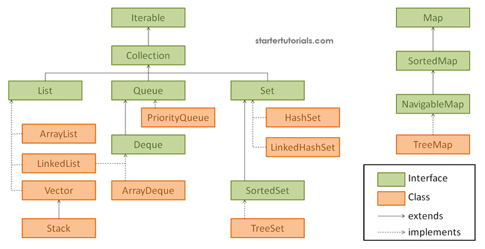

- Is a collection of all __generic__ classes, methods and interfaces that are used for data storage.
	- a frame work is set of classes and interfaces
-
- any group of individual objects that are represented as a __single unit__ is known as a __collection__
- 
-
-
- the `Collection` interface is the root of all collections.
	- Map interface is a separate part not in collections
- the collection interface forms a tree with all other interfaces that implement it.
-
- ```
  import java.util.Collection;
  
  Collection<Integer> c1 = new ArrayList<>();
  ```
-
- methods -
	- public interface Collections<E> extends Iterable<E>;
	- >boolean add(E e)
	  boolean addAll(Collection<? extends E> c)
	  void clear()
	  boolean contains(Object o)
	  boolean containsAll(Collection<?> c)
	  boolean equals(Object o)
	  int hashCode()
	  boolean isEmpty()
	  Iterator<E> iterator()
	  boolean remove(Object o)
	  boolean removeAll(Collection<?> c)
	  retailAll(Collection<?> c)
	  int size()
	  Object[] toArray()
-
- the `Collections` class is a helper class that provides additional functionality for the collections